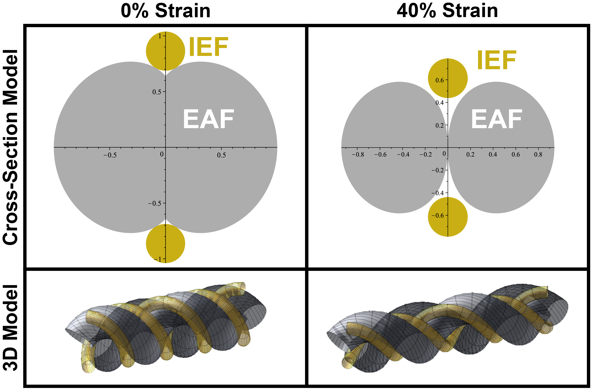

# 4-hay-model

## Geometric Model for 4-Component Helical Auxetic Yarn

A Maple script that produces a geometrical model for 4-component helical auxetic yarns at arbitrary strain. The user may specify the following parameters:

- Elastic core initial diameter
- Winding diameter
- Initial pitch (helical length)
- Elastic core Poisson's ratio
- Final strain
- Number of turns

The geometry generator has the following assumptions:

- The fibres are locally stiff, meaning that we neglect the force and any resulting indentation between them.
- The inextensible fibres always occupy the grooves in the extensible fibre double helix and each have point contacts with both extensible fibres in the cross-section.
- The inextensible fibres have circular cross-section, allowing the use of the parallel wires formula to estimate capacitance.

The script generates 3D renderings of the fibre geometries, cross-sectional bitmap images, and estimated capacitance versus strain.

## More Information

Please see the included presentation (presented at the [E-Textiles 2023](https://e-textilesconference.com/) Conference) and paper below (with associated SI) for further details. Please cite if this work is useful to you. This script was used in the following conference proceedings:
> Hannigan, B. C., Cuthbert, T. J., & Menon, C. (2023). HACS4x: 4-Ply Helical Auxetic Capacitive Sensors for Strain Sensing E-textiles. _Engineering Proceedings_. (Submitted)

©2023 ETH Zurich, Brett Hannigan; D-HEST; Biomedical and Mobile Health Technology (BMHT) Lab; Carlo Menon